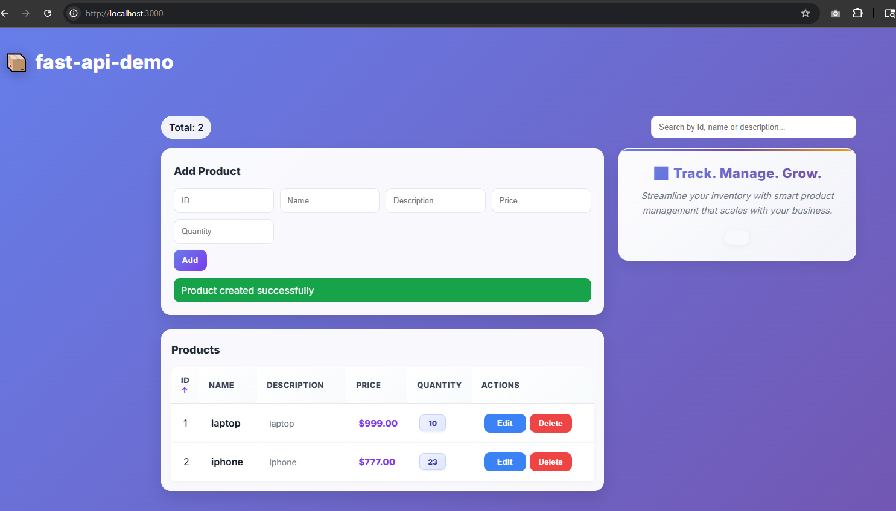

# fast-api-demo

## Introduction

A small FastAPI demo built around a `Product` CRUD resource, backed by PostgreSQL via SQLAlchemy. The codebase is intentionally laid out in a Spring-style layered architecture (router → service → repository → model) to make the mapping between FastAPI and a typical Java backend easy to follow.

### FastAPI concepts covered

The backend is small on purpose, but each piece demonstrates a distinct FastAPI feature:

- **App composition** — `FastAPI()` instance, `app.include_router(...)` to mount feature routers (`main.py`).
- **APIRouter** — grouping related endpoints with `prefix="/products"` and `tags=["Products"]` (`api/product_api.py`).
- **Path & body parameters** — `id: int` path param, Pydantic-validated request body (`ProductRequest`).
- **Dependency Injection** — `db: Session = Depends(get_db)` using a generator-based dependency that yields a SQLAlchemy session and closes it in `finally` (`core/database.py`).
- **Request validation with Pydantic v2** — `Field(min_length=3)`, `Field(gt=0)`, and a custom `@field_validator` for the `name` field (`schemas/product_schema.py`).
- **Error handling** — raising `HTTPException(status_code=400, ...)` to translate `ValueError` from the service layer into a proper HTTP response.
- **CORS middleware** — `CORSMiddleware` configured to allow the React dev server at `http://localhost:3000`.
- **Custom HTTP middleware** — an `@app.middleware("http")` function that times each request and writes the duration into the `X-Process-Time` response header.
- **Lifespan events** — `@app.on_event("startup")` / `@app.on_event("shutdown")` hooks for logging.
- **Rate limiting** — `slowapi` `Limiter` keyed on remote address, applied per-endpoint with `@limiter.limit("5/minute")` and a registered `RateLimitExceeded` handler (`core/limiter.py`).
- **SQLAlchemy ORM integration** — `declarative_base()`, `create_engine`, `sessionmaker`, and auto-creating tables at startup via `Base.metadata.create_all(bind=engine)`.
- **Layered architecture** — clean separation across `api/`, `services/`, `repositories/`, `models/`, `schemas/`, and `core/`.
- **Environment configuration** — `python-dotenv` loading `DATABASE_URL` from `.env`.
- **Testing** — `fastapi.testclient.TestClient` driving the app in-process with `pytest`.

## Config

### Prerequisites

- Python **3.12+**
- [`uv`](https://docs.astral.sh/uv/) for dependency management
- A running PostgreSQL instance

### Environment

Create a `.env` file at the repo root:

```
DATABASE_URL=postgresql://<user>:<password>@<host>:<port>/<database>
```

The value is loaded by `core/database.py` via `python-dotenv` (`load_dotenv(override=True)`).

### Install dependencies

```bash
uv sync
```

This installs everything declared in `pyproject.toml`: `fastapi`, `uvicorn`, `sqlalchemy`, `psycopg2`, `slowapi`, `python-dotenv`, `httpx`, and `pytest`.

### Database tables

No migration tool is used. On startup, `main.py` calls `Base.metadata.create_all(bind=engine)`, which creates any missing tables registered against `Base` (analogous to `spring.jpa.hibernate.ddl-auto=update`).

## How to use

### Run the API

From the repo root:

```bash
uv run uvicorn main:app --reload
```

The server listens on `http://localhost:8000`. Interactive docs are available at:

- Swagger UI: `http://localhost:8000/docs`
- ReDoc: `http://localhost:8000/redoc`

### Endpoints

| Method | Path             | Description              | Notes                                |
|--------|------------------|--------------------------|--------------------------------------|
| GET    | `/`              | Greeting / health check  |                                      |
| GET    | `/products/`     | List all products        | Rate-limited to **5 requests/min**   |
| GET    | `/products/{id}` | Fetch a product by ID    |                                      |
| POST   | `/products/`     | Create a product         | Validates body via `ProductRequest`  |
| PUT    | `/products/{id}` | Update a product's description |                                |
| DELETE | `/products/{id}` | Delete a product         |                                      |

### Request body (POST / PUT)

```json
{
  "id": 1,
  "name": "widget",
  "description": "a useful widget",
  "price": 9.99,
  "quantity": 10
}
```

Validation rules (from `schemas/product_schema.py`):

- `description` — minimum length 3
- `price` — must be `> 0`
- `quantity` — must be `> 0`
- `name` — must not contain spaces (custom `@field_validator`)

## Test cases

Tests live in `tests/` and use `fastapi.testclient.TestClient`, which drives the app in-process (no live server needed) but still exercises the real router, middleware, and database session stack.

Run the full suite:

```bash
uv run python -m pytest -v
```

Run a single test:

```bash
uv run python -m pytest tests/test_product_api.py::test_get_all_products -v
```

Current coverage in `tests/test_product_api.py`:

- `test_read_root` — verifies `GET /` returns `200` and the greeting payload.
- `test_get_all_products` — verifies `GET /products` returns `200`.
- `test_get_product_by_id` — verifies `GET /products/1` returns `200`.

Note: the tests run against whichever database `DATABASE_URL` points at, so use a disposable / dev database when running them.

## App Screenshot


## Credits
UI code copied from [this Repo](https://github.com/navinreddy20/fastapi-demo) with minimal adjustments. The backend is implemented with Navin Reddy sir's fastapi Youtube course.